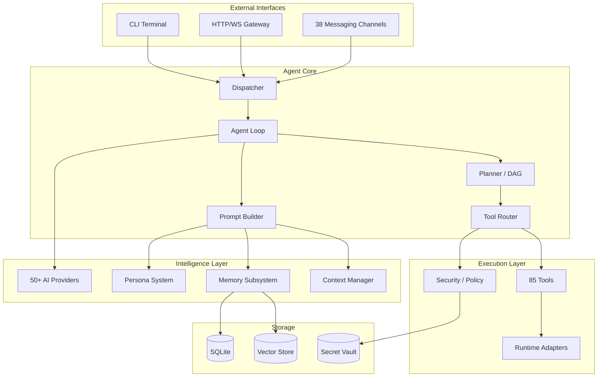
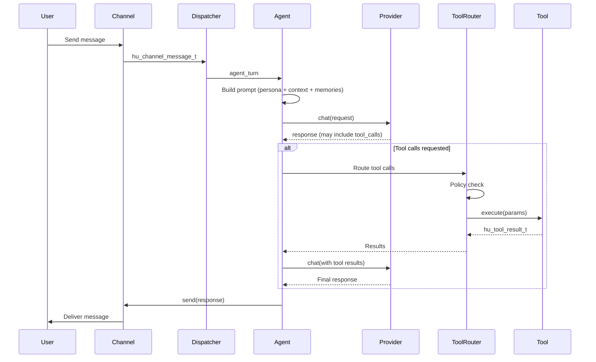

# Architecture

_not quite human._ human is a C11 autonomous AI assistant runtime. This document provides the structural overview — see `AGENTS.md` for the full engineering protocol.

## System Topology



## Request Flow

A message entering the system follows this path:



## Module Dependency Graph

Dependencies flow inward — implementations depend on contracts, never on each other.

```mermaid
graph TD
    subgraph contracts [Vtable Contracts - include/human/]
        ProviderH["provider.h"]
        ChannelH["channel.h"]
        ToolH["tools.h"]
        MemoryH["memory.h"]
        RuntimeH["runtime.h"]
        SecurityH["security.h"]
        PersonaH["persona.h"]
    end

    subgraph coreLib [Core Libraries - src/core/]
        Allocator["allocator"]
        Arena["arena"]
        JSON["json"]
        StringLib["string"]
        HTTP["http"]
        Error["error"]
    end

    subgraph implementations [Implementations - src/]
        ProvImpl["providers/ - 50+"]
        ChanImpl["channels/ - 38"]
        ToolImpl["tools/ - 85"]
        MemImpl["memory/ - 10 engines"]
        RTImpl["runtime/ - 5 adapters"]
        SecImpl["security/ - 11 sandboxes"]
        PersImpl["persona/ - 17 files"]
    end

    subgraph agentCore [Agent Core - src/agent/]
        AgentImpl["agent loop, planner, DAG, dispatcher"]
    end

    ProvImpl --> ProviderH
    ChanImpl --> ChannelH
    ToolImpl --> ToolH
    MemImpl --> MemoryH
    RTImpl --> RuntimeH
    SecImpl --> SecurityH
    PersImpl --> PersonaH

    ProvImpl --> HTTP
    ProvImpl --> JSON
    ChanImpl --> HTTP
    ChanImpl --> JSON
    ToolImpl --> SecurityH
    MemImpl --> JSON

    AgentImpl --> ProviderH
    AgentImpl --> ChannelH
    AgentImpl --> ToolH
    AgentImpl --> MemoryH
    AgentImpl --> PersonaH
    AgentImpl --> SecurityH

    ProviderH --> Allocator
    ChannelH --> Allocator
    ToolH --> Allocator
    MemoryH --> Allocator
    HTTP --> Allocator
    JSON --> Allocator
    StringLib --> Allocator
```



## Extension Points

All extension is done via vtable implementation + factory registration:

| Extension Point | Vtable            | Factory                   | Guide                  |
| --------------- | ----------------- | ------------------------- | ---------------------- |
| AI Provider     | `hu_provider_t`   | `src/providers/factory.c` | `AGENTS.md` 7.1        |
| Channel         | `hu_channel_t`    | `src/channels/factory.c`  | `AGENTS.md` 7.2        |
| Tool            | `hu_tool_t`       | `src/tools/factory.c`     | `AGENTS.md` 7.3        |
| Memory Engine   | `hu_memory_t`     | `src/memory/factory.c`    | `src/memory/CLAUDE.md` |
| Runtime         | `hu_runtime_t`    | `src/runtime/factory.c`   | `AGENTS.md` 7.5        |
| Peripheral      | `hu_peripheral_t` | `src/peripherals/`        | `AGENTS.md` 7.4        |

Pattern for every extension:

1. Implement the vtable struct with `void *ctx` + function pointers
2. Register in the module's `factory.c`
3. Callers OWN the implementing struct — never return a vtable pointing to a temporary

## ML Subsystem

Location: `src/ml/`, `include/human/ml/`. Gated behind `HU_ENABLE_ML`.

Components: BPE tokenizer, GPT model, MuonAdamW optimizer, data loader, training loop, experiment loop. Config-driven: `hu_experiment_config_t` parameterizes model architecture and optimizer. Same vtable-driven approach as the rest of the project (`hu_model_t`, `hu_ml_optimizer_t`).

## Key Directories

```
src/
  agent/       Agent loop, planner, DAG, context, prompt assembly
  channels/    38 messaging channel implementations
  providers/   50+ AI provider implementations
  tools/       85 tool implementations
  memory/      Memory engines, retrieval, vector, lifecycle
  ml/          ML training (BPE, GPT, MuonAdamW, experiment loop) — HU_ENABLE_ML
  security/    Policy, pairing, secrets, 11 sandbox backends
  gateway/     HTTP/WebSocket server, JSON-RPC control protocol
  persona/     Persona profiles, prompt builder, examples, adaptation
  runtime/     Native, Docker, WASM, Cloudflare, GCE adapters
  core/        Allocator, arena, JSON, string, HTTP, error

include/human/  Public C headers (vtable definitions)
tests/          291 test files, 6264+ tests
fuzz/           libFuzzer harnesses
ui/             LitElement web dashboard
website/        Astro marketing site
apps/           iOS, macOS, Android native apps + shared HumanKit
```

## Build Targets

| Preset    | Purpose                          | Command                  |
| --------- | -------------------------------- | ------------------------ |
| `dev`     | Development (ASan, all features) | `cmake --preset dev`     |
| `test`    | Testing (no ASan, fast)          | `cmake --preset test`    |
| `release` | Production (MinSizeRel + LTO)    | `cmake --preset release` |
| `fuzz`    | Fuzz testing (Clang, libFuzzer)  | `cmake --preset fuzz`    |
| `minimal` | CLI-only, no optional deps       | `cmake --preset minimal` |

## Performance Profile

| Metric                | Measured       |
| --------------------- | -------------- |
| Binary size (release) | ~1696 KB       |
| Cold start            | 4-27 ms        |
| Peak RSS              | ~5.7 MB        |
| Test throughput       | 700+ tests/sec |
