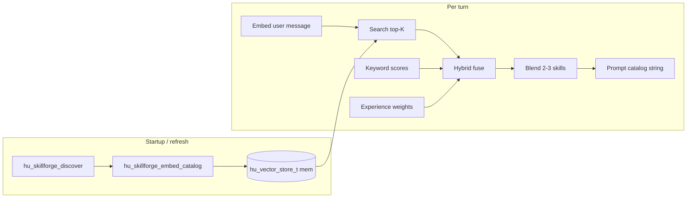

## Summary

SkillForge today builds a compact **Available Skills** catalog for the system prompt (`hu_skillforge_build_prompt_catalog` in `src/skillforge.c`), optionally ranking with **keyword overlap** when `HUMAN_SKILLS_CONTEXT=top_k`. Full playbooks load on demand via the **`skill_run`** tool (`src/tools/skill_run.c`). That stack is fast and dependency-light, but **lexical routing** misses paraphrases and emotional or conceptual overlap, and **skills are independent**—there is no first-class way to blend complementary playbooks or hint multi-step pipelines.

This proposal defines a **three-tier upgrade**: (1) **embedding-based retrieval** over a small per-skill text bundle, stored in the existing **`hu_vector_store_t`** (in-memory backend first) and queried with **`hu_embedder_t`**; (2) **multi-skill blending** (up to three skills per turn) guided by optional manifest metadata; (3) **experience-weighted re-ranking** when **`skill_profiles`** (see `docs/plans/2026-03-21-evolving-cognition.md`) exists, with cold-start neutrality. Optional **composition hints** (`sequence_after`) improve mid-pipeline suggestions from recent **`skill_run`** history.

New public entry points (names tentative but follow `hu_` / snake_case):

- `hu_skillforge_embed_catalog` — index or refresh skill vectors after discovery.
- `hu_skillforge_build_prompt_catalog_semantic` — per-turn catalog + blended injection, hybrid with keyword scores, fallback when no embedder.

All implementation remains **C11**, **vtable-driven**, **ASan-clean**, and **fail-soft**: if embedding is unavailable, behavior matches today’s keyword path.

## Background / Research

**Current behavior (codebase).**

- Discovery: `hu_skillforge_discover` scans for `*.skill.json`; `hu_skill_t` holds `name`, `description`, paths, `enabled` (`include/human/skillforge.h`).
- Catalog: `hu_skillforge_build_prompt_catalog` respects `HUMAN_SKILLS_CONTEXT`, `HUMAN_SKILLS_TOP_K` (default 12), `HUMAN_SKILLS_CONTEXT_MAX_BYTES` (default 8192) (`src/skillforge.c`).
- Deep content: `hu_skillforge_load_instructions` / **`skill_run`** for full `SKILL.md`.

**Gap.**

- Keyword overlap does not capture semantics (“I’m drowning” ↔ `triage`, `boundary-setting`, `self-regulation`).
- No **multi-skill activation** in one turn’s instructions.
- No **learned routing** from outcomes unless layered separately.

**External references.**

- **SkillOrchestra** (arXiv:2602.19672): fine-grained **skill competence** from execution traces; reports large gains vs. RL-only routing—motivates **experience-weighted** scores once telemetry exists.
- **Tool-to-Agent Retrieval** (arXiv:2511.01854): shared **embedding space** for tools/agents—aligns with embedding user messages and skill cards into the same geometry for cosine search.
- **pydantic-ai-skills** (Feb 2026): **progressive disclosure** and runtime discovery—aligns with keeping catalog small, full `SKILL.md` via **`skill_run`**, and optional “key points” excerpts only for blended secondaries.

**Existing building blocks.**

- **`hu_embedder_t`** + **`hu_embedding_t`** (`include/human/memory/vector.h`): `embed` / `embed_batch`, `hu_cosine_similarity`, local TF-IDF embedder for tests.
- **`hu_vector_store_t`**: `insert`, `search` with cosine-scored `hu_vector_entry_t`; **`hu_vector_store_mem_create`** for in-process index; pgvector/qdrant hooks for future persistence.
- **`hu_retrieval_engine_t`** (`include/human/memory/retrieval.h`): adaptive memory retrieval—**inspiration only** for skill routing (do not conflate document memory with skill index unless IDs are strictly namespaced).
- **Outbox / async embedding**: reuse the same async pattern as other embedding producers to avoid blocking cold start when network embedders are configured (exact wiring TBD in implementation; design assumes **non-blocking refresh** where possible).

## Design

### Goals

1. **Semantic retrieval** of skills for the current user message (and optionally short conversation prefix).
2. **Hybrid ranking** with the existing keyword scorer to preserve deterministic behavior on exact matches and rare embedding failures.
3. **Blended prompt sections** for 2–3 skills without blowing the catalog byte cap.
4. **Optional learning**: multiply scores by **Bayesian-smoothed** success rates from **`skill_profiles`** when the evolving-cognition schema is present.
5. **Composition hints**: suggest **next** skills when telemetry shows a pipeline in progress.

### Non-goals (YAGNI)

- Training custom embedding models inside the binary.
- Replacing **`skill_run`** as the source of truth for full playbooks.
- Storing full `SKILL.md` in the vector store (too large, redundant with disk)—only **short preview text** for retrieval.

### High-level flow



## Skill Embedding Pipeline

### Text to embed (per skill)

For each **enabled** skill, build a single UTF-8 string (normalized newlines, cap total length e.g. 2–4 KiB to bound embedder cost):

```
[name]\n[description]\n[first 200 chars of SKILL.md body]
```

- If `instructions_path` is missing, omit the SKILL snippet (manifest-only skills still embed).
- Strip YAML frontmatter from `SKILL.md` before taking the 200-character prefix (consistent with `hu_skillforge_load_instructions` behavior).
- Optional future field: **`tags`** from manifest—include in the same string when present.

### Vector ID and payload

- **ID**: stable string `skill:<name>` (namespace avoids collisions if the same store is ever shared).
- **`content` field in `hu_vector_entry_t`**: same text as embedded (or a shorter debug summary; must be enough to rebuild catalog lines if needed—prefer storing the **retrieval document** verbatim).

### When to (re)embed

- **After** `hu_skillforge_discover` completes successfully.
- **On manifest or SKILL.md mtime change** (optional optimization: hash per skill; full refresh acceptable for v1).
- **Never** in the hot path of every message for the full catalog—only **incremental** updates when the registry changes.

### API sketch

```c
/* After discover; requires embedder + vector store bound to SkillForge context. */
hu_error_t hu_skillforge_embed_catalog(hu_allocator_t *alloc, hu_skillforge_t *sf,
                                       hu_embedder_t *embedder, hu_vector_store_t *store);
```

- Use **`embed_batch`** when the provider implements it to amortize HTTP overhead for remote embedders.
- On partial failure: log (non-secret), leave affected skills unindexed, **fall back** to keyword-only for those names or entire catalog depending on severity (v1: if **any** critical error, disable semantic path for the session).

### Query-time embedding

- Embed **current user message** (same embedder/dimension as catalog).
- Optional v2: concatenate **last N** user turns (bounded bytes) for context-aware routing—out of scope for minimal v1 unless trivial.

## Multi-Skill Blending

### Selection

1. Take **hybrid-ranked** list after fuse + experience weight (see below).
2. **Primary**: rank 1.
3. **Secondaries**: up to two additional skills such that:
   - Each appears in **`pairs_with`** of the primary **or** in **`pairs_with`** of an already chosen secondary (undirected graph expansion), **or** if metadata absent, choose next-best by score subject to **diversity** (e.g. skip if cosine(skill A doc, skill B doc) > 0.98—optional).
4. **Hard cap**: **3** skills total per turn for blended **instruction** blocks (separate from the bullet **catalog** footer—see prompt format).

### Prompt format (injected section)

Keep the existing **name + description** list where it fits `HUMAN_SKILLS_CONTEXT_MAX_BYTES`. **Additional** block for blending (only when semantic/blend mode active):

```text
## Active skill blend (this turn)
Primary approach: <skill A name>
<condensed bullets or 3–5 lines from SKILL.md prefix / description—NOT full SKILL>

Also consider: <skill B name>
<2–4 lines>

Also consider: <skill C name>
<2–4 lines>

Use skill_run(skill_name) for full playbooks when depth is needed.
```

- **Condensation**: never ship full `SKILL.md` for secondaries in v1—use description + first N lines of body under a small per-skill byte budget (configurable).
- **Progressive disclosure** unchanged: **`skill_run`** remains mandatory for complete instructions.

### Metadata-driven compatibility

- **`pairs_with`**: symmetric **suggestion** list; validation only checks that names exist in `sf` (unknown names ignored with dev-mode warning).
- Cycles in pairing are allowed; ranking still breaks ties by hybrid score.

## Scoring Formula

### Per-skill signals

- **`semantic_score`**: cosine similarity from `hu_vector_store_t` search, mapped to `(0, 1]` e.g. `s_sem = (cosine + 1) / 2` or clamp raw cosine to nonnegative if model outputs nonnegative-only—**must match** embedder/store convention (document choice in code).
- **`keyword_score`**: existing overlap normalization from `hu_skillforge_build_prompt_catalog` internals (refactor to expose **`hu_skillforge_score_skills_keyword`** or equivalent for reuse).
- **`experience_weight`**: from **`skill_profiles`** when available; else **`1.0`**.

### Hybrid fusion

**Option A — Reciprocal Rank Fusion (RRF)** (recommended for robustness when scales differ):

\[
\text{RRF}(d) = \sum_{r \in \{\text{sem}, \text{kw}\}} \frac{w_r}{k + \text{rank}_r(d)}
\]

- Constants: `k` typically 60 (same family as classic RRF); `w_sem`, `w_kw` from env (defaults `1.0` / `1.0`).
- Then multiply by **`experience_weight`**:

\[
\text{final}(d) = \text{RRF}(d) \times \text{experience\_weight}(d)
\]

**Option B — Linear blend** (simpler):

\[
\text{final}(d) = \bigl(\alpha \cdot s_{\text{sem}} + (1-\alpha) \cdot s_{\text{kw}}\bigr) \times \text{experience\_weight}(d)
\]

- \(\alpha\) from config (default `0.7` toward semantic when embeddings exist).

**Cold start / missing semantic**: set \(s_{\text{sem}} = s_{\text{kw}}\) or skip semantic list so RRF degrades to keyword-only rank.

### Experience weight (Bayesian smoothing)

Align with `docs/plans/2026-03-21-evolving-cognition.md`:

- Let `successes`, `attempts` be aggregates per skill (and optionally per contact—if contact-scoped weights exist, prefer **contact** when `contact_id` is in agent context).
- Smoothed positive rate:

\[
p = \frac{\text{successes} + \beta m}{\text{attempts} + \beta}
\]

- Prior `m` and strength `β` are config (e.g. `m = 0.5`, `β = 2`).
- **`experience_weight`**: map `p` to a bounded multiplier e.g. `[0.75, 1.25]` so bad skills are down-ranked but never erased:

\[
w_{\text{exp}} = 0.75 + 0.5 \cdot p
\]

- If `attempts == 0`, **`w_exp = 1.0`**.

### Final ordering

Sort enabled skills by **`final` descending**, then take top **`HUMAN_SKILLS_TOP_K`** for the catalog list; run **blending** only on the top **M** (e.g. `M = 5`) to reduce work, then cap blended output at **3** skills.

## Schema Extensions

Extend `*.skill.json` with **optional** fields (backward compatible; parsers ignore unknown keys today—verify `skillforge` JSON parsing tolerates extras or add explicit parsing).

| Field | Type | Purpose |
|--------|------|---------|
| `pairs_with` | array of string | Complementary skills to blend when this skill is primary or secondary |
| `sequence_after` | array of string | Suggested **next** skills after this one in a workflow (directed hints) |

Example:

```json
{
  "name": "brainstorming",
  "description": "...",
  "pairs_with": ["prioritization", "simplification"],
  "sequence_after": ["prioritization"]
}
```

**Parsing:** extend `hu_skill_t` with optional `char **` arrays + lengths (or packed JSON slice) owned by SkillForge; free on destroy.

**Validation:** `sequence_after` and `pairs_with` reference **skill names**, not paths; circular **sequence** graphs are OK—runtime only **suggests**, never forces.

### Composition awareness (runtime)

- Maintain a short **ring buffer** of recent **`skill_run`** skill names from the current session (agent context).
- If the last run is `brainstorming` and its manifest lists `sequence_after: ["prioritization"]`, boost **`prioritization`**’s `keyword_score` or add a **tie-break bonus** (e.g. multiply by `1.05`) before hybrid fuse—small enough to not override strong semantic matches.

## Integration Points

| Component | Change |
|-----------|--------|
| `include/human/skillforge.h` | Declare `hu_skillforge_embed_catalog`, `hu_skillforge_build_prompt_catalog_semantic`; extend `hu_skill_t` for optional metadata |
| `src/skillforge.c` | Implement embedding index, hybrid scoring, blending string builder; factor keyword scorer for shared use |
| `src/agent/agent_turn.c` | After SkillForge init/discover, call **`hu_skillforge_embed_catalog`** once; per turn call **semantic** builder when `HUMAN_SKILLS_ROUTING=semantic` (or auto-detect embedder non-NULL) |
| `hu_embedder_t` / factories | No vtable change expected—use existing providers (Gemini, Ollama, Voyage, etc.) configured like memory embedders |
| `hu_vector_store_t` | Use **`hu_vector_store_mem_create`**; optional future: dedicated small store per agent to avoid ID collision |
| Evolving cognition | Read **`skill_profiles`** via intelligence/SQLite layer when flag on; pass `contact_id` if available |
| **`skill_run`** | Optional: record invocations for **sequence_after** boosting (already planned for learning in evolving-cognition) |

**Replacement semantics:** `hu_skillforge_build_prompt_catalog_semantic` **supersedes** the keyword-only builder **only when** semantic mode is enabled and embedder + store are healthy; otherwise delegate to **`hu_skillforge_build_prompt_catalog`**.

## Configuration

| Variable | Purpose |
|----------|---------|
| `HUMAN_SKILLS_ROUTING` | `keyword` (default), `semantic`, `hybrid` |
| `HUMAN_SKILLS_SEMANTIC_ALPHA` | Linear blend weight (if linear mode selected in build) |
| `HUMAN_SKILLS_RRF_K` | RRF constant `k` |
| `HUMAN_SKILLS_RRF_W_SEM` / `W_KW` | RRF weights |
| `HUMAN_SKILLS_BLEND_MAX` | Max blended skills (default 3, hard cap) |
| `HUMAN_SKILLS_BLEND_BYTES` | Per-turn byte budget for blend section |
| Existing | `HUMAN_SKILLS_CONTEXT`, `HUMAN_SKILLS_TOP_K`, `HUMAN_SKILLS_CONTEXT_MAX_BYTES` — **unchanged** semantics for list truncation |

**Security / privacy:** embedding text is **non-secret** skill metadata + public playbook snippets; user message embedding follows same policy as memory embedders (no secrets in prompts).

## Testing

- **Unit**: hybrid score ordering with fixed fake embeddings (use **`hu_embedder_local_create`** or injected dimensions); RRF tie behavior; `experience_weight` boundaries; empty store fallback.
- **Integration**: `HU_IS_TEST` SkillForge fixtures with small fake `SKILL.md`; assert **`hu_skillforge_embed_catalog`** + search returns expected ordering for a crafted message.
- **Regression**: existing `hu_skillforge_build_prompt_catalog` tests in `tests/test_subsystems.c` unchanged when routing=`keyword`.
- **ASan**: full suite; no leaks on embed batch failure paths.
- **Determinism**: no live network in tests; mock embedder returns fixed vectors for cosine assertions.

## Risks

| Risk | Mitigation |
|------|------------|
| **Startup latency** if embedding 100+ skills remotely | Batch embed; async outbox; cache serialized vectors on disk (future); or lazy index |
| **Binary / RAM budget** | In-memory store only for float vectors; dimension matches `HU_EMBEDDING_DIM` or provider dim—document footprint |
| **Stale index** | Refresh on discover; mtime/hash; version skill index schema |
| **Bad blends** | Strong primary; small secondary excerpts; user can ignore; tune `pairs_with` in registry over time |
| **Overfitting** experience weights | Bayesian smoothing; narrow multiplier band; cold start neutral |
| **ID collision** with memory vectors | Prefix IDs `skill:`; prefer dedicated store handle per SkillForge |

## References

- `include/human/skillforge.h`, `src/skillforge.c` — catalog and discovery
- `include/human/memory/vector.h` — `hu_embedder_t`, `hu_embedding_t`, `hu_vector_store_t`, `hu_cosine_similarity`
- `src/tools/skill_run.c` — progressive disclosure
- `docs/plans/2026-03-21-evolving-cognition.md` — `skill_profiles`, invocation logging, `hu_skillforge_build_prompt_catalog_weighted` (complementary; merge formulas carefully)
- `docs/plans/2026-03-20-static-skills-dynamic-agents-unification.md` — skills vs agents
- `docs/research/2026-03-20-sota-agents-skills-companion.md` — embedding retrieval note
- SkillOrchestra — arXiv:2602.19672
- Tool-to-Agent Retrieval — arXiv:2511.01854
- pydantic-ai-skills (Feb 2026) — progressive disclosure patterns
