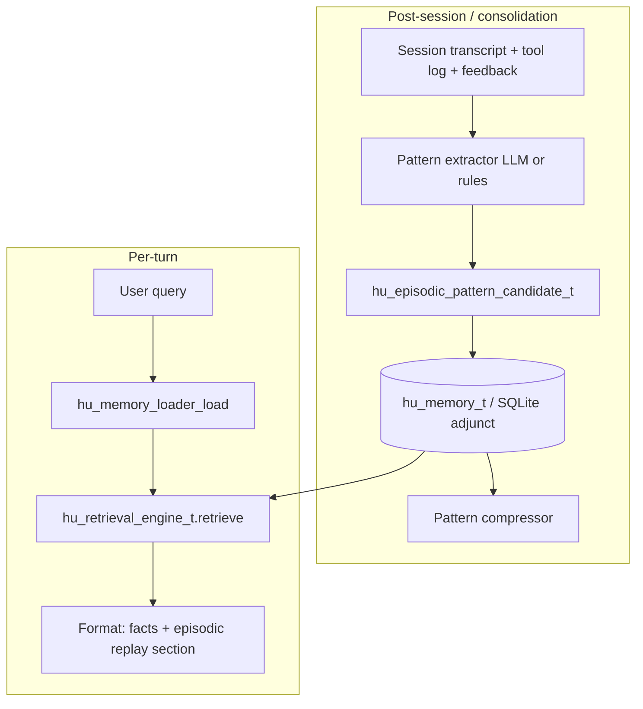

# Elastic memory: episodic pattern extraction and cognitive replay

## Summary

This document proposes an **episodic pattern** layer on top of the existing `hu_memory_t` stack: after sessions (or during consolidation), extract **reusable problem-solving sequences** (problem type, approaches/skills used, outcome quality, compact insight). At retrieval time (`hu_memory_loader_load`), **cognitive replay** injects a short, attributed summary of the best-matching past patterns so the model can reuse what worked—weighted by outcome quality and recency. **Pattern compression** merges three or more structurally similar episodes into one abstract pattern with an evidence count.

The design favors **minimal schema surface area**: either a new `hu_memory_category_tag_t` value plus structured JSON in `hu_memory_entry_t.content`, or a dedicated SQLite adjunct table keyed into the main memory row set—both options are spelled out below. All public symbols follow **C11**, `hu_` prefix, `snake_case`, and must remain **ASan-clean** (explicit ownership, no vtable temporaries).

## Background / Research

### Current system (h-uman)

- **Storage and API**: `hu_memory_t` exposes `store` / `store_ex`, `recall`, `get`, `list`, `forget`, and optional `count` / `health_check` / `deinit` via `hu_memory_vtable_t` (`include/human/memory.h`). Entries carry `hu_memory_category_t`, optional `session_id`, `source`, and `score`.
- **Per-turn retrieval**: `hu_memory_loader_load` (`include/human/agent/memory_loader.h`, `src/agent/memory_loader.c`) builds markdown context. When a `hu_retrieval_engine_t` is attached, it uses adaptive strategy selection, optional **strategy learner** feedback (`hu_strategy_learner_*`), and `hu_retrieval_options_t` (mode, limit, min_score, reranking, temporal decay).
- **Consolidation**: `hu_memory_consolidate` (`include/human/memory/consolidation.h`, `src/memory/consolidation.c`) merges and deduplicates with configurable decay, dedup threshold, and optional LLM-backed connection discovery via `hu_consolidation_config_t`.
- **Existing episodic store**: `hu_episode_sqlite_t` and friends (`include/human/memory/episodic.h`, `src/memory/episodic.c`) model **contact-scoped narrative episodes** (summary, emotional arc, key moments, salience). That is complementary: it captures *what happened* with whom; this proposal captures **how problems were solved** in a reusable form.

### External research

- **AutoAgent** (arXiv:2603.09716): *Elastic Memory Orchestrator* organizes history into raw records, compressed trajectories, and reusable **episodic abstractions**—motivating a three-tier mental model (raw → compressed trajectory → abstract pattern) and periodic re-organization.
- **MemMA** (arXiv:2603.18718): multi-agent memory coordination and in-situ self-evolution suggest **explicit hooks** for feedback-driven updates (outcome signals refine pattern quality) and careful **provenance** so replay text does not masquerade as ground truth.

### Gap

Long-term memory today emphasizes **facts and conversation snippets**. It does not systematically surface **cognitive patterns**: sequences of reasoning or tool use that repeatedly succeeded for a class of problems. Users benefit from prompts like: “Last time a similar architecture decision came up, you used first-principles decomposition then a small prototype, and the outcome was strong.”

## Design

### Goals

1. **Extract** structured episodic patterns from session artifacts (messages, tool/skill invocations, user feedback if available).
2. **Store** them durably with clear tagging and optional links to source sessions or memory keys.
3. **Retrieve** under the same query as factual memory, with a dedicated **cognitive replay** block in the markdown context.
4. **Compress** redundant patterns after **≥ 3** similar episodes into one abstract pattern with metadata (support count, date range).
5. **Integrate** without breaking existing backends: SQLite-first implementation; Markdown/LRU engines may no-op or store serialized JSON files if configured.

### Non-goals (initial phase)

- Cross-user or federated pattern sharing.
- Replacing the knowledge graph or emotional graph; patterns may **link** to entities but do not subsume graph storage.
- Guaranteed correctness of “what worked”: replay is **heuristic**, attributed, and must be phrased so the model treats it as **prior habit**, not verified fact (see Risks).

### Architecture overview



### Extraction pipeline (conceptual stages)

1. **Segment**: Identify bounded “problem episodes” within a session (goal shift, explicit user problem statement, or tool-heavy sub-span).
2. **Classify**: Assign `problem_type` (controlled vocabulary or free text with normalization).
3. **Sequence**: From structured tool/skill logs, build ordered `approach_steps[]` (skill id, tool name, or coarse tactic label).
4. **Score outcome**: Map implicit signals (user thumbs-up, task completion flag, retry count, sentiment delta from emotional residue) to `outcome_quality` ∈ [0,1] or enum.
5. **Verbalize**: Produce `insight_text` (“When facing X, approach Y worked because Z”) for storage and embedding.
6. **Persist**: Write pattern record; index for vector/keyword retrieval like other memory content.

### Cognitive replay (retrieval semantics)

- Run the **same** retrieval query against episodic patterns (either unified index or second pass filtered by tag).
- Rank by `combined = w_q * retrieval_score + w_o * outcome_quality + w_t * temporal_decay + w_s * support_count_boost`, with conservative defaults (e.g. `w_o` modest so bad priors do not dominate).
- Inject a **fixed-prefix section** in markdown, e.g. `## Cognitive patterns (prior approaches)`, with at most `N` items and a hard character budget (reuse `max_context_chars` fraction, e.g. 15–25%).
- Each line: short **attribution** (for example, evidence count and date range) and the **insight_text**—never raw chain-of-thought.

### Pattern compression

- Maintain a **canonical pattern id** and optional `cluster_id`.
- When a new candidate matches an existing pattern above similarity threshold (embedding cosine + same `problem_type` bucket), increment `support_count` and widen `evidence_session_ids` / time range.
- When `support_count >= 3` and variance of outcomes is low, **promote** to `abstracted = true` and replace verbose per-episode text with a single summary line plus bullet of dominant approach steps.
- Prune or demote low-support stale patterns via existing **forgetting** / consolidation decay.

## Schema

### Option A — Memory entry only (lowest coupling)

- Add category tag `HU_MEMORY_CATEGORY_EPISODIC_PATTERN` (or use `HU_MEMORY_CATEGORY_INSIGHT` with a **key prefix** `episodic_pattern:` during transition).
- `content` is **JSON** (UTF-8) with version field `schema_version: 1`.

Example JSON document:

```json
{
  "schema_version": 1,
  "pattern_id": "uuid-or-hash",
  "problem_type": "architecture_decision",
  "problem_summary": "Choosing persistence for a high-write workload",
  "approach_steps": [
    {"kind": "skill", "id": "first_principles", "order": 0},
    {"kind": "tool", "name": "file_read", "order": 1}
  ],
  "outcome_quality": 0.82,
  "outcome_source": "implicit_task_complete",
  "insight_text": "For architecture tradeoffs, first-principles constraints then a small spike reduced rework.",
  "support_count": 3,
  "abstracted": true,
  "first_seen_at": "2026-03-01T12:00:00Z",
  "last_seen_at": "2026-03-20T18:00:00Z",
  "source_session_ids": ["sess_a", "sess_b", "sess_c"],
  "linked_memory_keys": ["mem/key/123"],
  "embedding_ref": "optional-internal-id"
}
```

- **Key**: deterministic `episodic_pattern:<pattern_id>` or hash of `(problem_type, normalized insight)` for dedup.
- **Pros**: Works across any backend that can store blobs; retrieval engine unchanged except indexing.
- **Cons**: Harder SQL analytics; compression queries scan JSON or rely on FTS on `insight_text` flattened to a column in SQLite engine.

### Option B — SQLite adjunct table (analytics-friendly)

New table `hu_episodic_patterns` (names illustrative):

| Column | Type | Notes |
|--------|------|--------|
| `pattern_id` | TEXT PK | UUID |
| `memory_key` | TEXT | FK-style link to main memory key if mirrored |
| `problem_type` | TEXT | Indexed |
| `insight_text` | TEXT | For FTS / display |
| `payload_json` | TEXT | Full schema as JSON |
| `outcome_quality` | REAL | Indexed for ranking |
| `support_count` | INTEGER | |
| `abstracted` | INTEGER | 0/1 |
| `first_seen_at` | TEXT | ISO8601 |
| `last_seen_at` | TEXT | ISO8601 |
| `created_at` | TEXT | |

**Recommendation**: Start with **Option A** for portability; add **Option B** when SQLite-only analytics or batch compression jobs require it. Keep JSON schema identical so migration is a copy.

## Structs and API

New header e.g. `include/human/memory/episodic_pattern.h` (name bikeshed OK; avoid clashing with `episodic.h` episode types).

### Core structs

```c
typedef enum hu_episodic_pattern_step_kind {
    HU_EPISODIC_STEP_SKILL,
    HU_EPISODIC_STEP_TOOL,
    HU_EPISODIC_STEP_TACTIC, /* coarse label when no id */
} hu_episodic_pattern_step_kind_t;

typedef struct hu_episodic_pattern_step {
    hu_episodic_pattern_step_kind_t kind;
    const char *id_or_name;
    size_t id_or_name_len;
    uint32_t order;
} hu_episodic_pattern_step_t;

typedef struct hu_episodic_pattern_record {
    const char *pattern_id;
    size_t pattern_id_len;
    const char *problem_type;
    size_t problem_type_len;
    const char *problem_summary;
    size_t problem_summary_len;
    const hu_episodic_pattern_step_t *steps;
    size_t step_count;
    double outcome_quality;   /* 0.0 .. 1.0, NAN = unset */
    const char *insight_text;
    size_t insight_text_len;
    uint32_t support_count;
    bool abstracted;
    const char *first_seen_at;
    size_t first_seen_at_len;
    const char *last_seen_at;
    size_t last_seen_at_len;
} hu_episodic_pattern_record_t;
```

### Serialization

- `hu_episodic_pattern_to_json(const hu_episodic_pattern_record_t *r, hu_allocator_t *alloc, char **out, size_t *out_len);`
- `hu_episodic_pattern_from_json(hu_allocator_t *alloc, const char *json, size_t json_len, hu_episodic_pattern_record_t *out, bool *ok);`
- `hu_episodic_pattern_free_json_fields(hu_allocator_t *alloc, hu_episodic_pattern_record_t *r);` — frees heap substrings if parser allocates.

### Extraction and compression

```c
typedef struct hu_episodic_extract_input {
    const char *session_id;
    size_t session_id_len;
    /* Opaque handles to transcript + tool log; concrete types TBD */
    const void *transcript_ctx;
    const void *tool_log_ctx;
    hu_provider_t *provider; /* NULL = heuristic-only extract */
} hu_episodic_extract_input_t;

hu_error_t hu_episodic_pattern_extract(hu_allocator_t *alloc, const hu_episodic_extract_input_t *in,
                                       hu_episodic_pattern_record_t **out_patterns, size_t *out_count);

hu_error_t hu_episodic_pattern_compress_cluster(hu_allocator_t *alloc, hu_memory_t *memory,
                                                const char *cluster_key, size_t cluster_key_len,
                                                uint32_t min_support /* default 3 */);
```

### Retrieval helper

```c
typedef struct hu_episodic_replay_config {
    size_t max_patterns;
    size_t max_chars;
    double weight_retrieval;
    double weight_outcome;
    double weight_recency;
    double weight_support;
} hu_episodic_replay_config_t;

/* Returns markdown fragment; caller frees with alloc. May return HU_OK and empty string. */
hu_error_t hu_episodic_replay_format(hu_allocator_t *alloc, hu_memory_t *memory,
                                     hu_retrieval_engine_t *engine,
                                     const char *query, size_t query_len,
                                     const hu_episodic_replay_config_t *cfg,
                                     char **out_md, size_t *out_len);
```

### Integration with `hu_memory_loader_t`

Preferred shape: **internal call** from `hu_memory_loader_load` after factual entries are gathered—append replay section if enabled in config. Avoid growing `hu_memory_loader_t` unless needed; a single `bool enable_episodic_replay` + `hu_episodic_replay_config_t` in agent config is enough.

## Integration Points

| Area | File / symbol | Change |
|------|----------------|--------|
| Categories | `include/human/memory.h` | Add `HU_MEMORY_CATEGORY_EPISODIC_PATTERN` (or document key-prefix convention). |
| Consolidation | `hu_memory_consolidate`, `src/memory/consolidation.c` | After dedup / connection pass, invoke `hu_episodic_pattern_extract` on batches of session-linked entries; then `hu_episodic_pattern_compress_cluster`. Guard with `HU_IS_TEST`. |
| Loader | `src/agent/memory_loader.c`, `hu_memory_loader_load` | Optional second retrieval pass + `hu_episodic_replay_format` append under char budget. |
| Retrieval | `hu_retrieval_engine_t`, `src/memory/retrieval/engine.c` | Ensure episodic entries are indexed like others; optional `min_score` / category filter in `hu_retrieval_options_t` extension. |
| Existing episodic | `include/human/memory/episodic.h` | Document distinction: **episodes** = narrative contact summaries; **patterns** = cross-session tactics. Optional: `source_session_ids` may reference same sessions used to build episodes. |
| Forgetting | `src/memory/forgetting.c` | Apply decay to `outcome_quality` or demote low-support patterns consistently with other memory tiers. |

## Configuration

Proposed config keys (names align with existing JSON style in `config` schema when implemented):

| Key | Type | Default | Purpose |
|-----|------|---------|---------|
| `memory.episodic_patterns.enabled` | bool | `false` | Master switch |
| `memory.episodic_patterns.extract_on` | string | `"consolidation"` | `"session_end"` \| `"consolidation"` \| `"both"` |
| `memory.episodic_patterns.compress_min_support` | int | `3` | Abstraction threshold |
| `memory.episodic_patterns.replay.max_items` | int | `3` | Cap injected patterns |
| `memory.episodic_patterns.replay.max_chars` | int | `800` | Sub-budget for replay section |
| `memory.episodic_patterns.replay.weights` | object | see Design | Ranking weights |

All provider-backed extraction must respect **HTTPS / policy** and `HU_IS_TEST` stubs.

## Testing

- **Unit**: JSON round-trip `hu_episodic_pattern_to_json` / `from_json`; empty and malformed JSON; boundary `outcome_quality`.
- **Memory**: Extractor with fixture transcript → exactly N patterns; **zero leaks** under tracking allocator.
- **Integration**: `hu_memory_loader_load` with replay enabled: golden markdown substring for fixture DB; deterministic ranking with fixed timestamps.
- **Compression**: Three synthetic patterns same cluster → `abstracted == true`, `support_count == 3`.
- **Regression**: Existing memory and retrieval tests unchanged when feature flag off.

## Risks

| Risk | Mitigation |
|------|------------|
| **False confidence** — model treats replay as fact | Fixed wording (“prior approach”, “may not apply”), keep replay subordinate to tool-grounded context; cap count and chars. |
| **Privacy leakage** across sessions | Respect `session_id` scoping where configured; strip PII in `insight_text`; optional per-space pattern store. |
| **Latency / cost** on hot path | Run heavy extraction only on consolidation; retrieval uses existing index + small second pass. |
| **Schema drift** | `schema_version` in JSON; migration table for adjunct option. |
| **Binary size** | Keep optional behind `#ifdef` or linker-friendly weak stubs if needed for minimal builds. |

## References

- AutoAgent — *Elastic Memory Orchestrator* (arXiv:2603.09716).
- MemMA — multi-agent memory and self-evolution (arXiv:2603.18718).
- `include/human/memory.h` — `hu_memory_t`, `hu_memory_entry_t`, categories.
- `include/human/agent/memory_loader.h`, `src/agent/memory_loader.c` — `hu_memory_loader_load`.
- `include/human/memory/retrieval.h`, `src/memory/retrieval/engine.c` — `hu_retrieval_engine_t`.
- `include/human/memory/consolidation.h`, `src/memory/consolidation.c` — `hu_memory_consolidate`.
- `include/human/memory/episodic.h`, `src/memory/episodic.c` — existing **episode** store (narrative / contact-scoped).
