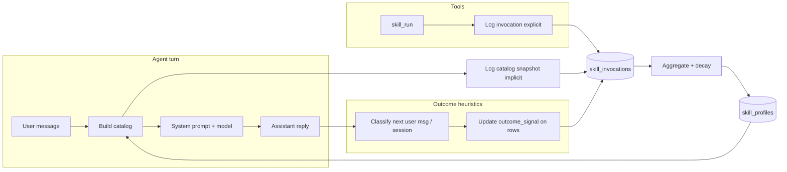

# Evolving cognition: skill feedback loops and per-user learning

## Summary

SkillForge today discovers registry skills from `~/.human/skills/`, ranks them for the system prompt with keyword overlap when `HUMAN_SKILLS_CONTEXT=top_k`, and loads full playbooks via the `skill_run` tool. That path is **open-loop**: the runtime never records which skills were shown, invoked, or helpful for a given user.

This plan proposes a **closed feedback loop**—inspired by structured, prompt-level cognition that updates from observed outcomes (see AutoAgent, §References)—implemented as:

1. **SQLite-backed invocation logging** for explicit `skill_run` calls and implicit “skills in catalog this turn.”
2. **Lightweight heuristic outcome signals** (no extra LLM calls) attached to recent invocations.
3. **Per-contact aggregates** with exponential decay, surfaced as weights in a new catalog builder: `hu_skillforge_build_prompt_catalog_weighted`.
4. **Environment toggles** so learning can be disabled for privacy, debugging, or deterministic tests (`HU_IS_TEST` must bypass persistence).

The design keeps C11 constraints, `hu_` / `snake_case` naming, allocator discipline, and ASan-clean tests.

---

## Background / Research

**Current pipeline (registry skills)**

- Discovery: `hu_skillforge_discover` (`src/skillforge.c`), typically from `~/.human/skills/` at bootstrap (`src/bootstrap.c`).
- Prompt injection: `hu_skillforge_build_prompt_catalog` in `src/agent/agent_turn.c` (under `HU_HAS_SKILLS`), merged with optional SQLite-backed **learned** contact context via `hu_skill_build_contact_context` (`include/human/intelligence/skills_context.h`, `src/intelligence/skills.c`).
- Deep content: `skill_run` tool (`src/tools/skill_run.c`, `include/human/tools/skill_run.h`).

**Conceptual gap**

Registry skills and intelligence-layer “skills” (the `skills` table: strategies with `success_rate`, `attempts`, `successes`) solve different problems. Registry skills are **installed playbooks**; intelligence skills are **learned strategies**. This proposal adds **telemetry and reweighting for registry skill names** tied to `skill_run` and catalog exposure, without conflating the two row types. New tables use distinct names (`skill_invocations`, `skill_profiles`) to avoid ambiguity with the existing `skills` table.

**Research anchor**

AutoAgent (arXiv:2603.09716) argues for **structured cognition** in the prompt (tools, capabilities, task knowledge) that **updates from outcomes**. We adopt the loop shape—intended action → observation → update—while staying **heuristic and local** (per contact, on-device SQLite) to meet cost, latency, and privacy constraints.

---

## Design

### Goals

- Record **every** `skill_run` execution with enough context to attribute outcomes to a skill and a contact.
- Infer **implicit** exposure: which registry skills were candidates in the top-k catalog for a turn (for outcome attribution when the model never called `skill_run`).
- Maintain **decayed aggregates** per `(contact_id, skill_name)` for ranking.
- Integrate into SkillForge catalog construction as **keyword_score × profile_weight** without breaking the default path when learning is off.

### Non-goals

- LLM-based outcome classification (cost, latency, determinism).
- Cross-user federated learning or cloud sync.
- Automatic modification of `SKILL.md` files or manifests.
- Replacing the intelligence module’s learned `skills` rows; only **coordination** (same `sqlite3 *db`, optional future unified dashboards).

### Data flow



### Outcome semantics

- **Explicit invocation row**: inserted when `skill_run` succeeds (skill name known).
- **Implicit catalog rows** (optional, config-gated): one row per skill name in the final merged catalog for that turn, or a single row with serialized skill list in `context_json` / companion table—implementation choice below prefers **one row per skill** for simpler attribution queries, with shared `turn_id` or `context_hash` to group them.

- **Outcome signal** (`outcome_signal`): small integer enum, e.g. `HU_SKILL_OUTCOME_UNKNOWN=0`, `POSITIVE`, `NEGATIVE`, `MIXED`, set asynchronously when the **next** user message (or session end) is processed—see §Outcome Signal Collection.

### Ranking

For each candidate skill `s`:

- `keyword_score` — existing overlap score from `hu_skillforge_build_prompt_catalog` (refactor internals to expose per-skill scores for weighted sort).
- `profile_weight` — Bayesian-smoothed positive rate with prior `(α, β)` (e.g. α=2, β=2):  
  `weight = (positive_w + α) / (positive_w + negative_w + α + β)`  
  where `positive_w` / `negative_w` are **decay-weighted** counts from `skill_invocations` (or pre-aggregated in `skill_profiles` with periodic recomputation).

- **Final score**: `keyword_score * profile_weight` (multiplicative). Cold start: prior keeps weights near 0.5 so keyword ranking still dominates.

### Decay

- Half-life style: event at age \(t\) days contributes `exp(-ln(2) * t / half_life_days)` to positive/negative tallies, or equivalently parameterize `HUMAN_SKILLS_LEARNING_DECAY_DAYS` as the **e-folding time** \( \tau \): weight \( = \exp(-t/\tau) \). Document the chosen mapping in code comments and config help text.

---

## Schema

All DDL is **idempotent** (`CREATE TABLE IF NOT EXISTS`) and lives next to other memory/intelligence migrations (pattern: `hu_*_init_tables` on the shared `sqlite3 *` from `hu_sqlite_memory_get_db`).

### Table: `skill_invocations`

| Column | Type | Notes |
|--------|------|--------|
| `id` | INTEGER PRIMARY KEY | Row id |
| `skill_name` | TEXT NOT NULL | Registry skill name (SkillForge) |
| `contact_id` | TEXT | Nullable for anonymous CLI; bind session id same as `agent->memory_session_id` |
| `ts_unix` | INTEGER NOT NULL | Unix seconds (UTC) |
| `context_hash` | BLOB NULL | Optional 32-byte hash: user msg + sorted catalog names + turn nonce |
| `trigger` | TEXT NOT NULL | `"explicit_skill_run"` \| `"catalog_exposure"` \| future |
| `outcome_signal` | INTEGER NOT NULL DEFAULT 0 | Enum; 0 = unknown until updated |
| `turn_correlation_id` | TEXT NULL | UUID or monotonic id per agent turn for batch updates |

**Indexes**

- `(contact_id, skill_name, ts_unix DESC)` for profile aggregation.
- `(turn_correlation_id)` for attaching outcomes to a batch of catalog rows.

### Table: `skill_profiles` (materialized aggregate)

Recomputed incrementally or via periodic job (implementation detail); **read path** must be O(1) per skill lookup with an in-memory cache optional.

| Column | Type | Notes |
|--------|------|--------|
| `contact_id` | TEXT NOT NULL | |
| `skill_name` | TEXT NOT NULL | |
| `invocation_count` | INTEGER | Explicit + implicit rows counted per policy |
| `positive_count` | REAL | Decay-weighted |
| `negative_count` | REAL | Decay-weighted |
| `last_used_ts` | INTEGER | Max `ts_unix` seen |
| `avg_score` | REAL | Optional cached `positive / (positive + negative)` with floor/ceiling |

**Primary key**: `(contact_id, skill_name)`.

**Note:** Storing **float** decay weights in `positive_count` / `negative_count` avoids full rescans; alternatively store integer counts + `last_recompute_ts` and renormalize in batch—trade binary size vs. simplicity.

### Relationship to existing `skills` table

No foreign key between `skill_profiles` and intelligence `skills`—different namespaces. If product needs a unified view, add a read-only view or UI query later.

---

## Structs and API

### Enums

```c
typedef enum {
    HU_SKILL_INV_TRIGGER_EXPLICIT_RUN = 1,
    HU_SKILL_INV_TRIGGER_CATALOG = 2,
} hu_skill_inv_trigger_t;

typedef enum {
    HU_SKILL_OUTCOME_UNKNOWN = 0,
    HU_SKILL_OUTCOME_POSITIVE = 1,
    HU_SKILL_OUTCOME_NEGATIVE = 2,
    HU_SKILL_OUTCOME_MIXED = 3,
} hu_skill_outcome_t;
```

### Invocation record (in-memory)

```c
typedef struct hu_skill_invocation_record {
    const char *skill_name;
    size_t skill_name_len;
    const char *contact_id;
    size_t contact_id_len;
    int64_t ts_unix;
    hu_skill_inv_trigger_t trigger;
    const uint8_t *context_hash; /* 32 bytes or NULL */
    const char *turn_correlation_id;
    size_t turn_correlation_id_len;
} hu_skill_invocation_record_t;
```

### Public functions (proposed)

New translation unit e.g. `src/intelligence/skill_learning.c` + `include/human/intelligence/skill_learning.h` (names illustrative; align with `docs/standards/engineering/naming.md`).

| Function | Purpose |
|----------|---------|
| `hu_skill_learning_init_tables(sqlite3 *db)` | DDL |
| `hu_skill_learning_log_invocation(...)` | Insert one row |
| `hu_skill_learning_log_catalog_exposure(...)` | Batch insert for top-k names + `turn_correlation_id` |
| `hu_skill_learning_apply_outcome(sqlite3 *db, const char *turn_id, hu_skill_outcome_t o)` | Set `outcome_signal` on matching rows |
| `hu_skill_learning_rebuild_profiles(sqlite3 *db, const char *contact_id, size_t cid_len, double tau_days)` | Optional maintenance |
| `hu_skill_learning_get_weights(sqlite3 *db, hu_allocator_t *alloc, const char *contact_id, size_t cid_len, hu_skill_profile_weight_t **out, size_t *n)` | Load map for one contact for catalog build |

```c
typedef struct hu_skill_profile_weight {
    char *skill_name; /* owned if allocated by getter */
    double weight;    /* profile_weight after prior */
} hu_skill_profile_weight_t;
```

### SkillForge

```c
/* Same as hu_skillforge_build_prompt_catalog but multiplies keyword rank by per-skill weights.
 * weights may be NULL or empty → identical to unweighted behavior (or prior-only if configured). */
hu_error_t hu_skillforge_build_prompt_catalog_weighted(
    hu_allocator_t *alloc,
    hu_skillforge_t *sf,
    const char *user_msg,
    size_t user_msg_len,
    const hu_skill_profile_weight_t *weights,
    size_t weights_len,
    char **out,
    size_t *out_len);
```

Implementation: factor shared ranking from `hu_skillforge_build_prompt_catalog` (`src/skillforge.c`) so both paths call a common scorer; keep getenv behavior for `HUMAN_SKILLS_CONTEXT`, `HUMAN_SKILLS_TOP_K`, `HUMAN_SKILLS_CONTEXT_MAX_BYTES` unchanged.

---

## Integration points

### `skill_run` (`src/tools/skill_run.c`)

After validating the skill and **before** returning instructions to the model:

- If `HUMAN_SKILLS_LEARNING` is `on` and not `HU_IS_TEST`, call `hu_skill_learning_log_invocation` with `HU_SKILL_INV_TRIGGER_EXPLICIT_RUN`, `contact_id` from agent context (tool execution may need a pointer to session id passed at `hu_skill_run_create` time—**API extension**: optional `contact_id` / `turn_correlation_id` in tool ctx struct).

Guard all DB work: null db, learning off, or test → no-op, `HU_OK`.

### `hu_agent_turn` (`src/agent/agent_turn.c`)

1. **Turn correlation id**: generate once per turn (stack buffer or arena), pass into prompt build and tool ctx.
2. After `hu_skillforge_build_prompt_catalog` (or weighted variant) succeeds, resolve the **list of skill names** actually included in the catalog string (either return side channel from SkillForge or parse—prefer **side channel**: array of `const char *` names from scorer to avoid fragile parsing).
3. Call `hu_skill_learning_log_catalog_exposure` batch with `HU_SKILL_INV_TRIGGER_CATALOG` when learning is on and SQLite memory is available (`hu_sqlite_memory_get_db` pattern already used ~lines 1280–1318).

4. **Outcome hook**: early in the **next** turn for the same session, or via a small helper invoked from the message ingress path, run the heuristic classifier on the **previous** user message + assistant reply (stored in session state). Update rows where `turn_correlation_id` matches the **completed** turn. Alternatively, classify when the new user message arrives and attribute to the immediately prior assistant turn—matches chat UX.

### Heuristic classifier (outline)

Pure C string heuristics + optional simple sentiment token counts (reuse patterns from existing sentiment note logic in `agent_turn.c` if available):

- **Positive**: thanks phrases, short acknowledgment + new substantive question, continued task keywords, absence of rejection phrases within N tokens.
- **Negative**: “not helpful”, “wrong”, “that didn’t work”, immediate rephrase of same intent, single-word dismissals.
- **Session drop**: timeout without user reply → optional `NEGATIVE` on catalog rows only (config-gated to avoid penalizing async channels).

Return `HU_SKILL_OUTCOME_UNKNOWN` when confidence is low—do not update aggregates.

### Config read

- `getenv("HUMAN_SKILLS_LEARNING")` — `on` / `off` (default **off** until validated).
- `getenv("HUMAN_SKILLS_LEARNING_DECAY_DAYS")` — positive double, default `90` (interpret as τ per §Design).

---

## Configuration

| Variable | Values | Default | Behavior |
|----------|--------|---------|----------|
| `HUMAN_SKILLS_LEARNING` | `on`, `off` | `off` | Master switch for logging + weighted catalog |
| `HUMAN_SKILLS_LEARNING_DECAY_DAYS` | number | `90` | Time constant for exponential decay |
| `HUMAN_SKILLS_CONTEXT` | existing | — | Unchanged; weighted path applies after top-k set is chosen or integrates into scorer |
| `HUMAN_SKILLS_TOP_K` | existing | — | Unchanged |

Privacy: document that **on** persists per-contact skill usage to SQLite under the same store as memory; users disable with `off`.

---

## Testing

- **Unit tests** (`tests/test_skill_learning.c` or extend `tests/test_subsystems.c`):

  - `init_tables` on temp `:memory:` DB.
  - Log explicit + catalog rows; `apply_outcome` updates `outcome_signal`.
  - Decay math: synthetic timestamps → expected weight within epsilon.
  - `hu_skillforge_build_prompt_catalog_weighted`: given fixed keyword scores and weights, order is deterministic.

- **Integration-style** (still no network):

  - `HU_IS_TEST`: all DB writes no-op or use isolated test DB per test file pattern used elsewhere.
  - `skill_run` test double: assert logging callback invoked when learning on (inject mock db or capture via test hook).

- **ASan / leaks**: every `*out` from allocators freed in tests; finalize SQLite statements; no `SQLITE_TRANSIENT`.

- **Regression**: existing `hu_skillforge_build_prompt_catalog` tests remain unchanged when weights NULL or learning off.

---

## Risks

| Risk | Mitigation |
|------|------------|
| **Wrong attribution** | Heuristics mis-label outcomes → noisy weights; use priors, decay, and optional “unknown” bucket; default learning **off** |
| **Prompt instability** | Frequent catalog reordering confuses the model; cap `profile_weight` to `[min, max]` band (e.g. 0.75–1.25 multiplicative) |
| **Table growth** | Retention job: archive or delete invocations older than N days; profiles stay small |
| **Dual skill concepts** | Document distinction between intelligence `skills` and SkillForge registry; clear naming in UI/docs |
| **Binary / RSS budget** | Keep hot path lean: batch writes deferred to end of turn where possible; cache profile map per session |
| **Multi-channel identity** | `contact_id` must be stable per product rules; document CLI anonymous behavior |

---

## References

- AutoAgent — structured prompt-level cognition and closed-loop updates: [arXiv:2603.09716](https://arxiv.org/abs/2603.09716)
- Existing catalog builder: `include/human/skillforge.h`, `src/skillforge.c` — `hu_skillforge_build_prompt_catalog`
- Agent integration: `src/agent/agent_turn.c` (skills context assembly; `hu_prompt_build_system` in `src/agent/prompt.c`)
- Tool surface: `src/tools/skill_run.c`, `include/human/tools/skill_run.h`
- Related intelligence / SQLite: `src/intelligence/skills.c`, `include/human/intelligence/skills_context.h`
- Engineering standards: `docs/standards/engineering/naming.md`, `docs/standards/engineering/testing.md`
