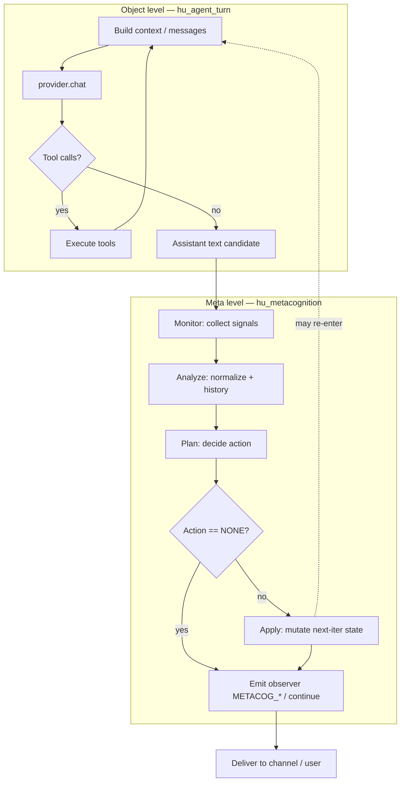

## V2 (2026-03-21) — shipped in tree

- **Pre-turn difficulty** via `hu_metacog_estimate_difficulty()` (heuristic; bumps `turn_thinking_budget` on HARD when already non-zero).
- **Extended signals**: `stuck_score`, `satisfaction_proxy`, `trajectory_confidence` (decay-weighted ring composite).
- **Trend + hysteresis**: `hu_metacog_compute_trend()`; costly actions require `hysteresis_min` consecutive breaches (immediate `SIMPLIFY` for repetition / token_efficiency).
- **Bounded re-entry**: up to `max_regen` extra `provider.chat` calls with `[METACOGNITION]` system suffix (`hu_metacognition_apply`).
- **SQLite flywheel**: `metacog_history` rows + `hu_metacog_label_from_followup()` updates `outcome_proxy` on the next user message (`pending_outcome_trace_id`).
- **BTH**: `metacog_regens`, `metacog_difficulty_*`, `metacog_hysteresis_suppressed`, `hula_tool_turns`.

---

# Metacognitive control loop: self-monitoring and adaptive strategy switching

## Summary

This proposal adds a **metacognitive control loop** around the existing agent turn pipeline so the runtime can **monitor** its own intermediate outputs and **discretely intervene** when signals indicate confusion, irrelevance, repetition, or misaligned tone. The object level remains `hu_agent_turn()` in `src/agent/agent_turn.c` (provider chat, tool parse/exec loop); the meta level is a new `hu_metacognition_t` façade that **reads** telemetry and conversation text to produce bounded `hu_metacognition_signal_t` values, then **writes** a small enum of control actions that adjust the *next* iteration (strategy flags, reflection, clarification, depth). The design is **language-mediated**: all monitoring uses text, token counts, and existing observer events—**no weight updates** and no provider fine-tuning. Integration reuses `hu_observer_record_event`, extends `hu_observer_event_tag_t` in `include/human/observer.h`, and composes with `hu_reflection_*` in `include/human/agent/reflection.h` where reflection is the right repair.

---

## Background / Research

### Nelson–Narens metacognition

Nelson and Narens frame metacognition as **two levels**: an **object level** that performs the task and a **meta level** that **monitors** object-level state and **controls** it. The meta level has imperfect access to object-level processing; in software, that maps cleanly to **observing** logs/events and **last assistant text**, then issuing **discrete control** (retry, re-prompt, change planner mode) rather than trying to introspect model internals.

### MAPE-K (Monitor–Analyze–Plan–Execute–Knowledge)

Autonomic computing’s MAPE-K loop is a production-grade pattern for closed-loop control:

| Phase | Human mapping |
| ----- | ------------- |
| **Monitor** | Observer events (`LLM_REQUEST` / `LLM_RESPONSE` / tool events), message text, `hu_bth_metrics_t` counters |
| **Analyze** | Heuristic + optional lightweight stats → `hu_metacognition_signal_t` |
| **Plan** | Thresholds and rules → `hu_metacognition_action_t` |
| **Execute** | `hu_metacognition_apply` mutates turn-local state, schedule, or prompts for the **next** provider call |
| **Knowledge** | Bounded ring buffer of signals + optional SQLite outcomes (“action → later user satisfaction proxy”) |

### Language-mediated self-monitoring without weight updates

The key empirical insight from recent **production-style** agent papers is that **verbal** self-critique and environment feedback can improve behavior **without** gradient updates: the model (or a rule layer) **reads** prior outputs and **decides** the next step. Representative systems:

- **Reflexion** — verbal reflection after failure drives retry with memory of mistakes.
- **Self-Refine** — iterative self-feedback on drafts.
- **Voyager** — skill library and curriculum driven by success/failure in the environment.
- **SOFAI-style** architectures — explicit separation of fast/slow or specialist modules with a controller.

Human already has pieces of the object level and parts of “reflection” (`hu_reflection_evaluate`, structured LLM rubric). This plan **does not** duplicate full Reflexion; it adds a **cheap, always-on monitor** and a **small action vocabulary** that can *trigger* reflection or depth changes when signals cross thresholds.

---

## Design

### Two-level architecture

- **Object level (existing)**  
  `hu_agent_turn()` drives the while-loop: build messages → `provider.vtable->chat` → parse tool calls → execute tools → repeat until final assistant text. Config and pressure live on `hu_agent_t` / `hu_agent_context_config_t` (`include/human/agent.h`): e.g. `tree_of_thought`, `mcts_planner_enabled`, `max_tool_iterations`, `turn_thinking_budget` (reasoning budget for providers that support it per `include/human/provider.h`).

- **Meta level (new)**  
  `hu_metacognition_t` is owned for the session or per agent; it maintains **read-only monitoring** on every assistant completion and **write-only control** when a discrete action is chosen. Separation of channels avoids accidental feedback loops where control writes pollute monitoring inputs in the same slice.

- **Two channels**

  | Channel | Access | Cadence | Data |
  | ------- | ------ | ------- | ---- |
  | **Monitoring** | Read-only on history + observer + optional embeddings cache | Continuous (after each model completion) | `hu_metacognition_signal_t` appended to bounded `hu_metacognition_signal_set_t` |
  | **Control** | Write-only to turn state / next-iteration flags | Discrete (0 or 1 action per collect→decide cycle) | `hu_metacognition_action_t` |

### Control flow (MAPE-K on the turn)



**Re-entry rule:** `hu_metacognition_apply` may set flags such as “force one regeneration pass” or “insert clarification tool/user message,” which causes **another** object-level iteration without treating the failed candidate as user-visible (exact UX is channel-dependent; tests use deterministic mocks).

---

## Structs and API

Proposed public surface (new header e.g. `include/human/agent/metacognition.h`, implementation `src/agent/metacognition.c`). Types follow C11, `hu_` prefix, `HU_SCREAMING_SNAKE` for enum constants.

### Opaque state

```c
typedef struct hu_metacognition hu_metacognition_t;
```

**Internal responsibilities (documented, not exposed):**

- Thresholds and feature flags (from env + config JSON).
- **Signal history**: ring buffer of `hu_metacognition_signal_t` (max `N`, e.g. 32).
- **Knowledge** (optional): SQLite table or in-memory LRU of `(signal_hash, action, outcome_proxy)` for offline analysis—not required for v1.

### Per-turn signals (all floats in `[0.0, 1.0]` unless noted)

```c
typedef struct hu_metacognition_signal {
    float confidence;           /* low = hedging / uncertainty markers */
    float coherence;            /* answer ↔ user question alignment */
    float skill_match;          /* invoked tools vs inferred topic */
    float satisfaction_proxy;   /* length / follow-up heuristics */
    float stuck_score;          /* repetition / tool-loop pressure */
    float emotional_alignment;  /* tone vs detected user affect */
    uint64_t turn_id;           /* monotonic or trace-derived */
} hu_metacognition_signal_t;
```

### Control actions

```c
typedef enum hu_metacognition_action {
    HU_METACOGNITION_ACTION_NONE,
    HU_METACOGNITION_ACTION_SWITCH_STRATEGY,
    HU_METACOGNITION_ACTION_ESCALATE_DEPTH,
    HU_METACOGNITION_ACTION_TRIGGER_REFLECTION,
    HU_METACOGNITION_ACTION_REQUEST_CLARIFICATION,
    HU_METACOGNITION_ACTION_RESET_APPROACH,
} hu_metacognition_action_t;
```

### Bounded collection

```c
#define HU_METACOGNITION_SIGNAL_CAP 32

typedef struct hu_metacognition_signal_set {
    hu_metacognition_signal_t items[HU_METACOGNITION_SIGNAL_CAP];
    size_t count;   /* <= cap; FIFO drop oldest on overflow */
    size_t head;    /* ring start index if ring semantics */
} hu_metacognition_signal_set_t;
```

### Lifecycle and operations

```c
hu_error_t hu_metacognition_init(hu_metacognition_t **out, hu_allocator_t *alloc,
                                 const hu_metacognition_config_t *cfg);

/* After assistant text is available, before user-visible send:
 * reads agent history slice, last tool records, observer-visible stats. */
hu_error_t hu_metacognition_collect(hu_metacognition_t *mc, hu_agent_t *agent,
                                    const char *user_message, size_t user_len,
                                    const char *assistant_draft, size_t draft_len);

/* Pure function of mc state + last collect; fills *out_action and optional *out_reason_len buffer. */
hu_error_t hu_metacognition_decide(const hu_metacognition_t *mc,
                                   hu_metacognition_action_t *out_action,
                                   char *reason_buf, size_t reason_cap, size_t *out_reason_len);

/* Mutates agent/turn scratch: toggles ctx flags, schedules reflection, queues clarification. */
hu_error_t hu_metacognition_apply(hu_metacognition_t *mc, hu_agent_t *agent,
                                  hu_metacognition_action_t action);

void hu_metacognition_deinit(hu_metacognition_t *mc);
```

`hu_metacognition_config_t` (in the same header) mirrors env/JSON thresholds and caps (max regenerations per turn, enable SQLite knowledge, etc.).

---

## Monitoring heuristics

All heuristics must be **deterministic** for tests (fixed tokenizer: whitespace + ASCII fold; no network). Optional LLM-assisted scoring stays **off** the default path.

| Signal | Heuristic (v1) | Notes |
| ------ | ---------------- | ----- |
| **confidence** | Count hedging tokens / max(1, total word count). Lexicon: `maybe`, `perhaps`, `might`, `i think`, `not sure`, `possibly`, `unclear`, `probably` (tune list). Score = `min(1.f, hedge_ratio * scale)`. | Cap so one hedge does not dominate long answers. |
| **coherence** | Tokenize user question and draft; compute Jaccard overlap on **content words** (strip stopwords). Optional: bigram overlap for short queries. | Cheap proxy for “on topic”; not semantic entailment. |
| **skill_match** | From last tool round: map tool names/tags to topic buckets; compare to keyword bucket from user message. Score = overlap ratio or 1.0 if no tools used (neutral). | If dynamic skill routing exists, consume its topic label (`docs/plans/2026-03-21-dynamic-skill-routing.md`). |
| **satisfaction_proxy** | Combine: (a) length ratio `draft_len / reference` where reference = `max(min_len, k * user_len)`; (b) if conversation shows rapid follow-up “that didn’t answer” patterns (regex/keywords), penalize. | Imperfect; use as **relative** signal within session. |
| **stuck_score** | (1) Cosine similarity of bag-of-words vectors for last 2–3 assistant drafts (high → stuck). (2) Increment if same tool+args repeated or `HU_OBSERVER_EVENT_TOOL_ITERATIONS_EXHAUSTED` fired. Normalize to [0,1]. | Requires small rolling buffer in `hu_metacognition_t`. |
| **emotional_alignment** | If user affect classifier or channel metadata provides `user_emotion` (see `docs/plans/2026-03-21-emotional-cognition.md`), compare to draft markers (apology density, dismissive phrases, warmth lexicon). Else neutral 0.5. | Default **no-op neutral** when affect unavailable. |

Emit raw counts alongside floats in observer payloads for debugging (behind config).

---

## Control actions

| Condition (typical) | Action | Effect on next iteration |
| ------------------- | ------ | ------------------------- |
| `confidence < τ_conf` | `TRIGGER_REFLECTION` | Call `hu_reflection_evaluate` / structured path; on `NEEDS_RETRY`, rebuild prompt chunk or single regen. |
| `coherence < τ_coh` | `REQUEST_CLARIFICATION` | Insert assistant or system follow-up asking narrow clarifying question; or set flag for template clarification message. |
| `stuck_score > τ_stuck` | `RESET_APPROACH` | Clear cached planner subgoal, rotate skill subset, change tool allowlist ordering, or prepend “try alternate framing” system injection. |
| `emotional_alignment < τ_emo` (and affect known) | `SWITCH_STRATEGY` | Prefer emotional / empathy-weighted skills and persona overlay (`docs/plans/2026-03-21-emotional-cognition.md`). |
| Complex problem heuristics while in **fast** cognition mode | `ESCALATE_DEPTH` | Flip to slow path: enable richer retrieval, raise `turn_thinking_budget`, enable `tree_of_thought` / planner per policy (`docs/plans/2026-03-21-dual-process-cognition.md`). |

Thresholds are config-driven; **no single rule** fires if `NONE` is safer (hysteresis: require 2 consecutive bad samples before `RESET_APPROACH`).

---

## Integration points

### Inside `hu_agent_turn` (`src/agent/agent_turn.c`)

1. **After** a non-tool final assistant message is produced (or after each assistant segment if streaming is unified in the loop), **before** channel send:
   - `hu_metacognition_collect(...)`.
   - `hu_metacognition_decide(...)`.
2. If `action != HU_METACOGNITION_ACTION_NONE`:
   - `hu_metacognition_apply(...)` adjusts:
     - Per-turn flags on `hu_agent_t` or a turn scratch struct (planner on/off, thinking budget bump).
     - Optional **one** extra provider pass (bounded counter to prevent infinite loops).
3. **Observer** (`include/human/observer.h`): extend `hu_observer_event_tag_t` with e.g.:
   - `HU_OBSERVER_EVENT_METACOG_SIGNALS` — struct payload: six floats + turn id.
   - `HU_OBSERVER_EVENT_METACOG_ACTION` — enum + optional short reason string (non-secret).
4. **BTH / metrics**: increment new counters on `hu_bth_metrics_t` if product wants aggregate rates (e.g. `metacog_actions_applied`, `metacog_reflection_triggered`), or keep observer-only for v1 to save struct churn.
5. **SQLite knowledge (optional)**: table `metacog_outcomes(session_id, turn_id, action, signal_blob, user_followup_proxy)` written **async** or post-turn to avoid hot-path latency; strictly best-effort.

### Composition with reflection

- `TRIGGER_REFLECTION` should **prefer** `hu_reflection_evaluate` when `use_llm` is false for latency; escalate to `hu_reflection_evaluate_structured` only when config demands and policy allows an extra provider call.
- Avoid double-charging: if reflection already ran for this draft, skip duplicate LLM critique.

---

## Configuration

### Environment variables

| Variable | Values | Purpose |
| -------- | ------ | ------- |
| `HUMAN_METACOGNITION` | `on` / `off` | Master switch (default `off` until shipped). |
| `HUMAN_METACOGNITION_CONFIDENCE_THRESHOLD` | float, default `0.3` | Below → reflection bias. |
| `HUMAN_METACOGNITION_COHERENCE_THRESHOLD` | float, default `0.25` | Below → clarification. |
| `HUMAN_METACOGNITION_STUCK_THRESHOLD` | float, default `0.7` | Above → reset approach. |
| `HUMAN_METACOGNITION_EMOTION_THRESHOLD` | float, default `0.35` | Below → strategy switch (when affect present). |
| `HUMAN_METACOGNITION_MAX_REGEN` | uint, default `1` | Cap extra provider iterations per turn. |

### `config.json` block (illustrative)

```json
"metacognition": {
  "enabled": false,
  "confidence_threshold": 0.3,
  "coherence_threshold": 0.25,
  "stuck_threshold": 0.7,
  "emotion_threshold": 0.35,
  "max_regenerations_per_turn": 1,
  "persist_outcomes_sqlite": false
}
```

Parser merges env overrides per existing config precedence rules.

---

## Testing

1. **Unit tests** (`tests/test_metacognition.c`): fixed strings for each signal:
   - Hedging density → expected confidence band.
   - Overlap/no-overlap pairs → coherence.
   - Repeated paragraphs → high stuck score.
   - Tool list vs topic keywords → skill_match.
2. **Golden files** optional for tokenizer edge cases (empty string, all stopwords).
3. **Integration test**: mock provider returning scripted assistant text and tool JSON; assert observer receives `METACOG_*` events and that `ESCALATE_DEPTH` sets a visible flag on the mock agent context.
4. **ASan / deterministic**: no real network; all LLM paths gated by `HU_IS_TEST` stubs.

---

## Risks

| Risk | Mitigation |
| ---- | ---------- |
| **Over-correction** — churn from repeated `RESET_APPROACH` | Hysteresis, hard cap on actions per turn, default `NONE` when signals disagree. |
| **Latency** — extra tokenization and similarity | O(n) bag-of-words on bounded windows; skip embeddings in v1; run collect only once per draft. |
| **False positives on stuck detection** | Require similarity **and** (tool loop OR iteration exhaustion); don’t fire on first duplicate in code-heavy answers. |
| **User-visible thrash** | Clarification and regen must respect channel policy; never loop more than `max_regen`. |
| **Privacy** | Observer payloads avoid raw PII in reason strings; log aggregates only. |

---

## References

- Nelson, T. O., & Narens, L. — metacognitive monitoring and control framework.
- IBM MAPE-K autonomic control loop (Monitor, Analyze, Plan, Execute, Knowledge).
- Shinn et al. — **Reflexion**: verbal reinforcement for agents.
- Madaan et al. — **Self-Refine**: iterative self-feedback.
- Wang et al. — **Voyager**: skill-driven embodied agent curriculum.
- SOFAI / modular agent literature — explicit fast/slow or specialist routing.

**Cross-links (this repo):**

- [`docs/plans/2026-03-21-dual-process-cognition.md`](2026-03-21-dual-process-cognition.md) — fast/slow/emotional modes; `ESCALATE_DEPTH` alignment.
- [`docs/plans/2026-03-21-dynamic-skill-routing.md`](2026-03-21-dynamic-skill-routing.md) — topic/skill labels for `skill_match` and `RESET_APPROACH`.
- [`docs/plans/2026-03-21-emotional-cognition.md`](2026-03-21-emotional-cognition.md) — affect-aware responses for `emotional_alignment` / `SWITCH_STRATEGY`.
- [`docs/plans/2026-03-21-evolving-cognition.md`](2026-03-21-evolving-cognition.md) — long-horizon adaptation; optional SQLite knowledge backfill.
- [`docs/plans/2026-03-21-elastic-memory-episodic.md`](2026-03-21-elastic-memory-episodic.md) — episodic context that may inform satisfaction proxies.

**Code anchors:**

- `hu_agent_turn()` — `src/agent/agent_turn.c`
- Observer — `include/human/observer.h` (`hu_observer_event_tag_t`, `hu_observer_record_event`)
- Reflection — `include/human/agent/reflection.h`
- Agent config — `include/human/agent.h` (`hu_agent_context_config_t`, `hu_agent_t`)
- Behavioral telemetry — `include/human/observability/bth_metrics.h` (`hu_bth_metrics_t`)
